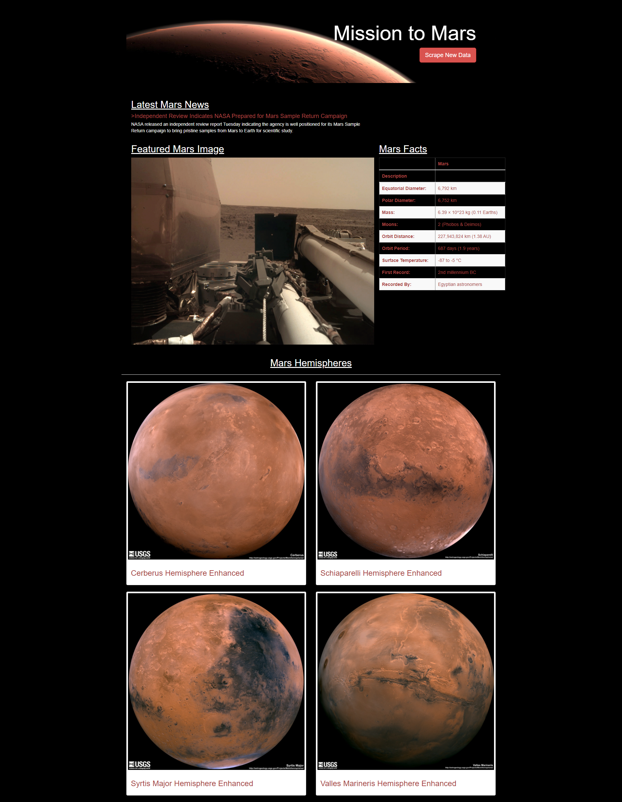

# Mission-to-Mars

## Purpose
The purpose of this project was to create a Flask web application that scrapes several different websites and returns the latest news, images and articles relating to Mars in a new HTML page.  The specific desired outputs for the new page listed below.

1. Latest News 
2. Latest Featured Image
3. Latest Mars Facts
4. Latest Mars Hemisphere Featured Images

## Resources
***Software:***
- Python 3.8
- Jupyter Notebook (anaconda3)
- VSCode 1.50
- Flask 1.1 
- Chromedriver 86.0.4240.22
- MongoDB 4.4 
- Pandas
- Splinter
- Beautiful Soup
- Bootstrap

***Websites:***
- https://mars.nasa.gov/news/ 
- https://www.jpl.nasa.gov/spaceimages/?search=&category=Mars 
- https://space-facts.com/mars/ 
- https://astrogeology.usgs.gov/search/results?q=hemisphere+enhanced&k1=target&v1=Mars 

## Summary
This project was completed in four major steps as outlined below.  

1. ***Scraping the Data***: The first step was to write a script using Splinter and BeautifulSoup to visit various websites, convert the html script to a soup object, parse the soup html and then collect the desired data.  The script was originally written in Jupyter Notebook to help with debugging and then exported to python and refactored.  The data collected was as follows.
   
    1. The title and short snippet of the latest news article was scraped from http://mars.nasa.gov/news/
    2. The latest featured image was scraped from https://www.jpl.nasa.gov/spaceimages/?search=&category=Mars
    3. The latest Mars facts table was scraped from https://space-facts.com/mars/
    4. The latest Mars weather data was scraped from https://mars.nasa.gov/insight/weather/  
       *(This script was written in the jupyter notebook file but later omitted from the python file since the decision was made not to include the information in the web app.)*
    5. The latest Mars hemispheres featured images were scraped from https://astrogeology.usgs.gov/search/results?q=hemisphere+enhanced&k1=target&v1=Mars

2. ***Storing the Data***:  The second step of the project was to build a place to store the results from the scrape where they can be easily accessed and retreived as needed.  This was done using a MongoDB non-relational database which can store both tabular and non-tabular data.  A new MongoDB database was created called mars_app.

3. ***Create the Web App***:  The third step was to 

